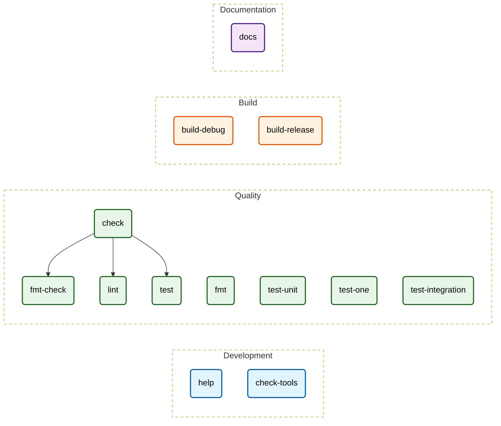

# Makefile Documentation
> *Auto-generated by [makefile2doc](https://github.com/Merlin-Clos/makefile2doc)*

## Cheat Sheet
| Command | Category | Description |
| :--- | :--- | :--- |
| [`make help`](#cmd-help) | [Development](#cat-development) | Show the generated development command reference |
| [`make check-tools`](#cmd-check-tools) | [Development](#cat-development) | Verify that all tools required by the development workflow are available |
| [`make check`](#cmd-check) | [Quality](#cat-quality) | Run every local quality check |
| [`make fmt-check`](#cmd-fmt-check) | [Quality](#cat-quality) | Check Rust formatting without modifying files |
| [`make fmt`](#cmd-fmt) | [Quality](#cat-quality) | Format all Rust sources |
| [`make lint`](#cmd-lint) | [Quality](#cat-quality) | Run Clippy on every target and feature with warnings denied |
| [`make test`](#cmd-test) | [Quality](#cat-quality) | Run the complete Rust test suite |
| [`make test-unit`](#cmd-test-unit) | [Quality](#cat-quality) | Run only library unit tests |
| [`make test-one`](#cmd-test-one) | [Quality](#cat-quality) | Run one exact library unit test; pass its full name with TEST=... |
| [`make test-integration`](#cmd-test-integration) | [Quality](#cat-quality) | Run only the integration test target |
| [`make build-debug`](#cmd-build-debug) | [Build](#cat-build) | Build the debug binary with development symbols |
| [`make build-release`](#cmd-build-release) | [Build](#cat-build) | Build the fully optimized and stripped release binary |
| [`make docs`](#cmd-docs) | [Documentation](#cat-documentation) | Generate MAKEFILE.md from this repository Makefile |

---

## Workflow Graph

---

## Section Details

### Development
| Command | Description | Dependencies | Required Variables |
| :--- | :--- | :--- | :--- |
| `make help` | Show the generated development command reference | - | - |
| `make check-tools` | Verify that all tools required by the development workflow are available | - | - |

### Quality
| Command | Description | Dependencies | Required Variables |
| :--- | :--- | :--- | :--- |
| `make check` | Run every local quality check | `fmt-check`, `lint`, `test` | - |
| `make fmt-check` | Check Rust formatting without modifying files | - | - |
| `make fmt` | Format all Rust sources | - | - |
| `make lint` | Run Clippy on every target and feature with warnings denied | - | - |
| `make test` | Run the complete Rust test suite | - | - |
| `make test-unit` | Run only library unit tests | - | - |
| `make test-one` | Run one exact library unit test; pass its full name with TEST=... | - | - |
| `make test-integration` | Run only the integration test target | - | - |

### Build
| Command | Description | Dependencies | Required Variables |
| :--- | :--- | :--- | :--- |
| `make build-debug` | Build the debug binary with development symbols | - | - |
| `make build-release` | Build the fully optimized and stripped release binary | - | - |

### Documentation
| Command | Description | Dependencies | Required Variables |
| :--- | :--- | :--- | :--- |
| `make docs` | Generate MAKEFILE.md from this repository Makefile | - | - |
