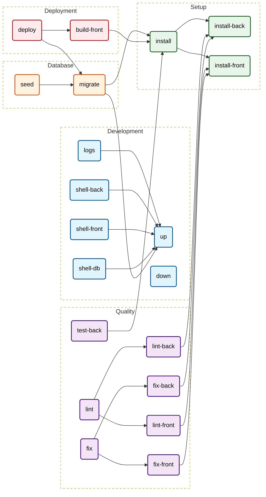

# Real-World Example

The best way to understand `makefile2doc` is to see it in action.
Below is the **Result** (the generated Markdown) and the **Input** (the raw Makefile) from our internal test suite.

## 1. The Result

# Makefile Documentation
> *Auto-generated by [makefile2doc](https://github.com/Merlin-Clos/makefile2doc)*

## Cheat Sheet
| Command | Category | Description |
| :--- | :--- | :--- |
| [`make up`](#development) | Development | Start the full development environment (Docker) |
| [`make down`](#development) | Development | Stop all containers |
| [`make logs`](#development) | Development | Show live logs for all services |
| [`make shell-back`](#development) | Development | Open a shell inside the PHP container (Laravel) |
| [`make shell-front`](#development) | Development | Open a shell inside the Node.js container |
| [`make shell-db`](#development) | Development | Open a shell inside the PostgreSQL container |
| [`make install-back`](#setup) | Setup | Install backend (Composer) |
| [`make install-front`](#setup) | Setup | Install frontend (NPM) dependencies |
| [`make install`](#setup) | Setup | Run both backend and frontend installations |
| [`make migrate`](#database) | Database | Run database migrations |
| [`make seed`](#database) | Database | Reset the DB and run seeds (Test data) <br> Warning: This deletes all data! |
| [`make test-back`](#quality) | Quality | Run unit tests (Pest/PHPUnit) |
| [`make lint-front`](#quality) | Quality | Lint frontend code (ESLint) |
| [`make lint-back`](#quality) | Quality | Lint backend code (PHP-CS-Fixer dry-run) |
| [`make fix-front`](#quality) | Quality | Fix frontend code style and format |
| [`make fix-back`](#quality) | Quality | Fix backend code style |
| [`make lint`](#quality) | Quality | Run all linters (front & back) |
| [`make fix`](#quality) | Quality | Fix all code style issues (front & back) |
| [`make build-front`](#deployment) | Deployment | Compile Frontend assets (Vite/Mix) |
| [`make deploy`](#deployment) | Deployment | Deploy to Production <br> 1. Build frontend assets <br> 2. Optimize Laravel cache <br> 3. Run migrations force |

---

## Workflow Graph


---

## Section Details

### Development
| Command | Description | Dependencies | Required Variables |
| :--- | :--- | :--- | :--- |
| `make up` | Start the full development environment (Docker) | - | `PORT` |
| `make down` | Stop all containers | - | - |
| `make logs` | Show live logs for all services | `up` | - |
| `make shell-back` | Open a shell inside the PHP container (Laravel) | `up` | - |
| `make shell-front` | Open a shell inside the Node.js container | `up` | - |
| `make shell-db` | Open a shell inside the PostgreSQL container | `up` | - |

### Setup
| Command | Description | Dependencies | Required Variables |
| :--- | :--- | :--- | :--- |
| `make install-back` | Install backend (Composer) | - | - |
| `make install-front` | Install frontend (NPM) dependencies | - | - |
| `make install` | Run both backend and frontend installations | `install-back`, `install-front` | - |

### Database
| Command | Description | Dependencies | Required Variables |
| :--- | :--- | :--- | :--- |
| `make migrate` | Run database migrations | `up`, `install` | - |
| `make seed` | Reset the DB and run seeds (Test data) <br> Warning: This deletes all data! | `migrate` | `SEED_CLASS` |

### Quality
| Command | Description | Dependencies | Required Variables |
| :--- | :--- | :--- | :--- |
| `make test-back` | Run unit tests (Pest/PHPUnit) | `install` | - |
| `make lint-front` | Lint frontend code (ESLint) | `install-front` | - |
| `make lint-back` | Lint backend code (PHP-CS-Fixer dry-run) | `install-back` | - |
| `make fix-front` | Fix frontend code style and format | `install-front` | - |
| `make fix-back` | Fix backend code style | `install-back` | - |
| `make lint` | Run all linters (front & back) | `lint-front`, `lint-back` | - |
| `make fix` | Fix all code style issues (front & back) | `fix-front`, `fix-back` | - |

### Deployment
| Command | Description | Dependencies | Required Variables |
| :--- | :--- | :--- | :--- |
| `make build-front` | Compile Frontend assets (Vite/Mix) | `install` | - |
| `make deploy` | Deploy to Production <br> 1. Build frontend assets <br> 2. Optimize Laravel cache <br> 3. Run migrations force | `build-front`, `migrate` | `APP_KEY`, `SSH_USER` |

---

## 2. The Input (`Makefile`)

This is the source Makefile using [The Convention](./convention.md).

> **Pro Tip:** We recommend using visual separators (like the # === lines below) to **clearly delimit your categories**. This keeps the raw file readable for humans, while the parser simply ignores them.

```makefile
# ==============================================================================
## @category Development
# ==============================================================================

## @description Start the full development environment (Docker)
## @env PORT
up:
	# docker compose up -d

## @description Stop all containers
down:
	# docker compose down

## @description Show live logs for all services
## @depends up
logs:
	# docker compose logs -f

## @description Open a shell inside the PHP container (Laravel)
## @depends up
shell-back:
	# docker compose exec app bash

## @description Open a shell inside the Node.js container
## @depends up
shell-front:
	# docker compose exec app bash

## @description Open a shell inside the PostgreSQL container
## @depends up
shell-db:
	# docker compose exec app bash

# ==============================================================================
## @category Setup
# ==============================================================================

## @description Install backend (Composer)
install-back:
	# docker compose run --rm app composer install

## @description Install frontend (NPM) dependencies
install-front:
	# docker compose run --rm app npm install

## @description Run both backend and frontend installations
## @depends install-back, install-front
install: install-back install-front

# ==============================================================================
## @category Database
# ==============================================================================

## @description Run database migrations
## @depends up, install
migrate:
	# docker compose exec app php artisan migrate

## @description Reset the DB and run seeds (Test data) \n Warning: This deletes all data!
## @depends migrate
## @env SEED_CLASS
seed:
	# docker compose exec app php artisan migrate:refresh --seed

# ==============================================================================
## @category Quality
# ==============================================================================

## @description Run unit tests (Pest/PHPUnit)
## @depends install
test-back:
	# docker-compose exec app php artisan test

## @description Lint frontend code (ESLint)
## @depends install-front
lint-front:
	# docker compose exec app npm run lint

## @description Lint backend code (PHP-CS-Fixer dry-run)
## @depends install-back
lint-back:
	# docker compose exec app php-cs-fixer

## @description Fix frontend code style and format
## @depends install-front
fix-front:
	# docker compose exec app npm run lint-fix && npm run format

## @description Fix backend code style
## @depends install-back
fix-back:
	# docker compose exec app php-cs-fixer --fix

## @description Run all linters (front & back)
## @depends lint-front, lint-back
lint: lint-front lint-back

## @description Fix all code style issues (front & back)
## @depends fix-front, fix-back
fix: fix-front fix-back

# ==============================================================================
## @category Deployment
# ==============================================================================

## @description Compile Frontend assets (Vite/Mix)
## @depends install
build-front:
	# npm run build

## @description Deploy to Production \n 1. Build frontend assets \n 2. Optimize Laravel cache \n 3. Run migrations force
## @depends build-front, migrate
## @env APP_KEY, SSH_USER
deploy:
	# git pull
	# docker compose exec app php artisan config:cache
	# docker compose exec app php artisan migrate --force
```
