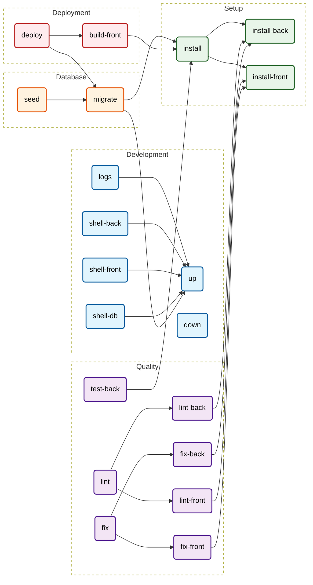

# Makefile Documentation
> *Auto-generated by [makefile2doc](https://github.com/Merlin-Clos/makefile2doc)*

## Cheat Sheet
| Command | Category | Description |
| :--- | :--- | :--- |
| [`make up`](#development) | Development | Start the full development environment (Docker) |
| [`make down`](#development) | Development | Stop all containers |
| [`make logs`](#development) | Development | Show live logs for all services |
| [`make shell-back`](#development) | Development | Open a shell inside the PHP container (Laravel) |
| [`make shell-front`](#development) | Development | Open a shell inside the Node.js container |
| [`make shell-db`](#development) | Development | Open a shell inside the PostgreSQL container |
| [`make install-back`](#setup) | Setup | Install backend (Composer) |
| [`make install-front`](#setup) | Setup | Install frontend (NPM) dependencies |
| [`make install`](#setup) | Setup | Run both backend and frontend installations |
| [`make migrate`](#database) | Database | Run database migrations |
| [`make seed`](#database) | Database | Reset the DB and run seeds (Test data)   Warning: This deletes all data! |
| [`make test-back`](#quality) | Quality | Run unit tests (Pest/PHPUnit) |
| [`make lint-front`](#quality) | Quality | Lint frontend code (ESLint) |
| [`make lint-back`](#quality) | Quality | Lint backend code (PHP-CS-Fixer dry-run) |
| [`make fix-front`](#quality) | Quality | Fix frontend code style and format |
| [`make fix-back`](#quality) | Quality | Fix backend code style |
| [`make lint`](#quality) | Quality | Run all linters (front & back) |
| [`make fix`](#quality) | Quality | Fix all code style issues (front & back) |
| [`make build-front`](#deployment) | Deployment | Compile Frontend assets (Vite/Mix) |
| [`make deploy`](#deployment) | Deployment | Deploy to Production   1. Build frontend assets   2. Optimize Laravel cache   3. Run migrations force |

---

## Workflow Graph

---

## Section Details

### Development
| Command | Description | Dependencies | Required Variables |
| :--- | :--- | :--- | :--- |
| `make up` | Start the full development environment (Docker) | - | `PORT` |
| `make down` | Stop all containers | - | - |
| `make logs` | Show live logs for all services | `up` | - |
| `make shell-back` | Open a shell inside the PHP container (Laravel) | `up` | - |
| `make shell-front` | Open a shell inside the Node.js container | `up` | - |
| `make shell-db` | Open a shell inside the PostgreSQL container | `up` | - |

### Setup
| Command | Description | Dependencies | Required Variables |
| :--- | :--- | :--- | :--- |
| `make install-back` | Install backend (Composer) | - | - |
| `make install-front` | Install frontend (NPM) dependencies | - | - |
| `make install` | Run both backend and frontend installations | `install-back`, `install-front` | - |

### Database
| Command | Description | Dependencies | Required Variables |
| :--- | :--- | :--- | :--- |
| `make migrate` | Run database migrations | `up`, `install` | - |
| `make seed` | Reset the DB and run seeds (Test data)   Warning: This deletes all data! | `migrate` | `SEED_CLASS` |

### Quality
| Command | Description | Dependencies | Required Variables |
| :--- | :--- | :--- | :--- |
| `make test-back` | Run unit tests (Pest/PHPUnit) | `install` | - |
| `make lint-front` | Lint frontend code (ESLint) | `install-front` | - |
| `make lint-back` | Lint backend code (PHP-CS-Fixer dry-run) | `install-back` | - |
| `make fix-front` | Fix frontend code style and format | `install-front` | - |
| `make fix-back` | Fix backend code style | `install-back` | - |
| `make lint` | Run all linters (front & back) | `lint-front`, `lint-back` | - |
| `make fix` | Fix all code style issues (front & back) | `fix-front`, `fix-back` | - |

### Deployment
| Command | Description | Dependencies | Required Variables |
| :--- | :--- | :--- | :--- |
| `make build-front` | Compile Frontend assets (Vite/Mix) | `install` | - |
| `make deploy` | Deploy to Production   1. Build frontend assets   2. Optimize Laravel cache   3. Run migrations force | `build-front`, `migrate` | `APP_KEY`, `SSH_USER` |
