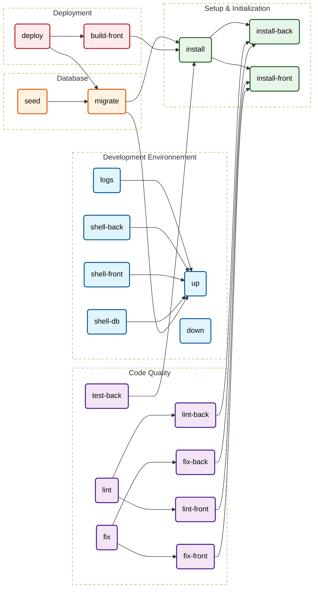

# Makefile Documentation
> *Auto-generated by [makefile2doc](https://github.com/Merlin-Clos/makefile2doc)*

## Cheat Sheet
| Command | Category | Description |
| :--- | :--- | :--- |
| [`make up`](#cmd-up) | [Development Environnement](#cat-development-environnement) | Start the full development environment (Docker) |
| [`make down`](#cmd-down) | [Development Environnement](#cat-development-environnement) | Stop all containers |
| [`make logs`](#cmd-logs) | [Development Environnement](#cat-development-environnement) | Show live logs for all services |
| [`make shell-back`](#cmd-shell-back) | [Development Environnement](#cat-development-environnement) | Open a shell inside the PHP container (Laravel) |
| [`make shell-front`](#cmd-shell-front) | [Development Environnement](#cat-development-environnement) | Open a shell inside the Node.js container |
| [`make shell-db`](#cmd-shell-db) | [Development Environnement](#cat-development-environnement) | Open a shell inside the PostgreSQL container |
| [`make install-back`](#cmd-install-back) | [Setup & Initialization](#cat-setup-initialization) | Install backend (Composer) |
| [`make install-front`](#cmd-install-front) | [Setup & Initialization](#cat-setup-initialization) | Install frontend (NPM) dependencies |
| [`make install`](#cmd-install) | [Setup & Initialization](#cat-setup-initialization) | Run both backend and frontend installations |
| [`make migrate`](#cmd-migrate) | [Database](#cat-database) | Run database migrations |
| [`make seed`](#cmd-seed) | [Database](#cat-database) | Reset the DB and run seeds (Test data)   Warning: This deletes all data! |
| [`make test-back`](#cmd-test-back) | [Code Quality](#cat-code-quality) | Run unit tests (Pest/PHPUnit) |
| [`make lint-front`](#cmd-lint-front) | [Code Quality](#cat-code-quality) | Lint frontend code (ESLint) |
| [`make lint-back`](#cmd-lint-back) | [Code Quality](#cat-code-quality) | Lint backend code (PHP-CS-Fixer dry-run) |
| [`make fix-front`](#cmd-fix-front) | [Code Quality](#cat-code-quality) | Fix frontend code style and format |
| [`make fix-back`](#cmd-fix-back) | [Code Quality](#cat-code-quality) | Fix backend code style |
| [`make lint`](#cmd-lint) | [Code Quality](#cat-code-quality) | Run all linters (front & back) |
| [`make fix`](#cmd-fix) | [Code Quality](#cat-code-quality) | Fix all code style issues (front & back) |
| [`make build-front`](#cmd-build-front) | [Deployment](#cat-deployment) | Compile Frontend assets (Vite/Mix) |
| [`make deploy`](#cmd-deploy) | [Deployment](#cat-deployment) | Deploy to Production   1. Build frontend assets   2. Optimize Laravel cache   3. Run migrations force |

---

## Workflow Graph

```mermaid
flowchart LR
    subgraph Development_Environnement[Development Environnement]
        up(up)
        down(down)
        logs(logs)
        shell-back(shell-back)
        shell-front(shell-front)
        shell-db(shell-db)
    end
    style Development_Environnement fill:transparent,stroke-dasharray: 5 5
    classDef cat0 fill:#E1F5FE,stroke:#01579B,stroke-width:2px,color:#000;
    class up cat0
    class down cat0
    class logs cat0
    class shell-back cat0
    class shell-front cat0
    class shell-db cat0
    subgraph Setup_&_Initialization[Setup & Initialization]
        install-back(install-back)
        install-front(install-front)
        install(install)
    end
    style Setup_&_Initialization fill:transparent,stroke-dasharray: 5 5
    classDef cat1 fill:#E8F5E9,stroke:#1B5E20,stroke-width:2px,color:#000;
    class install-back cat1
    class install-front cat1
    class install cat1
    subgraph Database[Database]
        migrate(migrate)
        seed(seed)
    end
    style Database fill:transparent,stroke-dasharray: 5 5
    classDef cat2 fill:#FFF3E0,stroke:#E65100,stroke-width:2px,color:#000;
    class migrate cat2
    class seed cat2
    subgraph Code_Quality[Code Quality]
        test-back(test-back)
        lint-front(lint-front)
        lint-back(lint-back)
        fix-front(fix-front)
        fix-back(fix-back)
        lint(lint)
        fix(fix)
    end
    style Code_Quality fill:transparent,stroke-dasharray: 5 5
    classDef cat3 fill:#F3E5F5,stroke:#4A148C,stroke-width:2px,color:#000;
    class test-back cat3
    class lint-front cat3
    class lint-back cat3
    class fix-front cat3
    class fix-back cat3
    class lint cat3
    class fix cat3
    subgraph Deployment[Deployment]
        build-front(build-front)
        deploy(deploy)
    end
    style Deployment fill:transparent,stroke-dasharray: 5 5
    classDef cat4 fill:#FFEBEE,stroke:#B71C1C,stroke-width:2px,color:#000;
    class build-front cat4
    class deploy cat4

    logs --> up
    shell-back --> up
    shell-front --> up
    shell-db --> up
    install --> install-back
    install --> install-front
    migrate --> up
    migrate --> install
    seed --> migrate
    test-back --> install
    lint-front --> install-front
    lint-back --> install-back
    fix-front --> install-front
    fix-back --> install-back
    lint --> lint-front
    lint --> lint-back
    fix --> fix-front
    fix --> fix-back
    build-front --> install
    deploy --> build-front
    deploy --> migrate
```

---

## Section Details

### Development Environnement
| Command | Description | Dependencies | Required Variables |
| :--- | :--- | :--- | :--- |
| `make up` | Start the full development environment (Docker) | - | `PORT` |
| `make down` | Stop all containers | - | - |
| `make logs` | Show live logs for all services | `up` | - |
| `make shell-back` | Open a shell inside the PHP container (Laravel) | `up` | - |
| `make shell-front` | Open a shell inside the Node.js container | `up` | - |
| `make shell-db` | Open a shell inside the PostgreSQL container | `up` | - |

### Setup & Initialization
| Command | Description | Dependencies | Required Variables |
| :--- | :--- | :--- | :--- |
| `make install-back` | Install backend (Composer) | - | - |
| `make install-front` | Install frontend (NPM) dependencies | - | - |
| `make install` | Run both backend and frontend installations | `install-back`, `install-front` | - |

### Database
| Command | Description | Dependencies | Required Variables |
| :--- | :--- | :--- | :--- |
| `make migrate` | Run database migrations | `up`, `install` | - |
| `make seed` | Reset the DB and run seeds (Test data)   Warning: This deletes all data! | `migrate` | `SEED_CLASS` |

### Code Quality
| Command | Description | Dependencies | Required Variables |
| :--- | :--- | :--- | :--- |
| `make test-back` | Run unit tests (Pest/PHPUnit) | `install` | - |
| `make lint-front` | Lint frontend code (ESLint) | `install-front` | - |
| `make lint-back` | Lint backend code (PHP-CS-Fixer dry-run) | `install-back` | - |
| `make fix-front` | Fix frontend code style and format | `install-front` | - |
| `make fix-back` | Fix backend code style | `install-back` | - |
| `make lint` | Run all linters (front & back) | `lint-front`, `lint-back` | - |
| `make fix` | Fix all code style issues (front & back) | `fix-front`, `fix-back` | - |

### Deployment
| Command | Description | Dependencies | Required Variables |
| :--- | :--- | :--- | :--- |
| `make build-front` | Compile Frontend assets (Vite/Mix) | `install` | - |
| `make deploy` | Deploy to Production   1. Build frontend assets   2. Optimize Laravel cache   3. Run migrations force | `build-front`, `migrate` | `APP_KEY`, `SSH_USER` |
